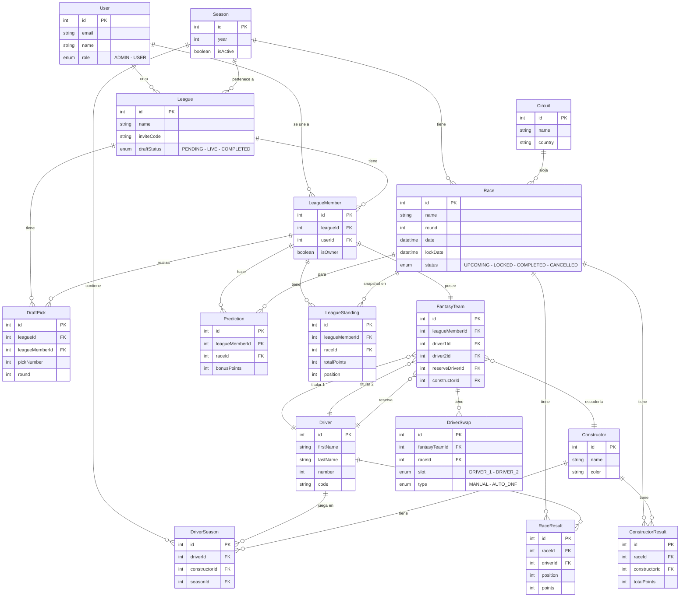

# Propuesta TP DSW

## Grupo

### Integrantes

* XXXXX - Apellido(s), Nombre(s)
* XXXXX - Apellido(s), Nombre(s)

### Repositorios

* [fullstack app](https://github.com/TomasPinolini/boxbox)

## Tema

### Descripción

BoxBox es una aplicación de Fantasy League de Fórmula 1. Los usuarios crean o se unen a ligas privadas mediante código de invitación, participan en un draft en vivo con formato snake para armar su equipo (2 pilotos titulares, 1 reserva y 1 escudería), y compiten a lo largo de la temporada. Los resultados reales de cada carrera se obtienen de APIs públicas de F1 para calcular los puntajes. Además, los usuarios pueden realizar predicciones antes de cada carrera y visualizar resúmenes de rendimiento.

### Modelo

## Alcance Funcional

### Alcance Mínimo

Regularidad:

| Req | Detalle |
|:-|:-|
| CRUD simple | 1. CRUD Driver 2. CRUD Constructor |
| CRUD dependiente | 1. CRUD Race {depende de} CRUD Circuit + CRUD Season |
| Listado + detalle | 1. Listado de pilotos filtrado por escudería, muestra nombre, número y equipo => detalle muestra estadísticas del piloto y resultados de carrera |
| CUU/Epic | 1. Realizar el draft en vivo de un equipo fantasy (snake draft con timer, selección de 2 pilotos titulares, 1 reserva y 1 escudería, picks exclusivos por liga) |

Adicionales para Aprobación:

| Req | Detalle |
|:-|:-|
| CRUD | 1. CRUD Driver 2. CRUD Constructor 3. CRUD Circuit 4. CRUD Season 5. CRUD Race 6. CRUD League 7. CRUD FantasyTeam |
| CUU/Epic | 1. Realizar el draft en vivo de un equipo fantasy (snake draft con WebSocket, timer por pick, auto-pick en timeout, selección libre de categoría por ronda, picks exclusivos dentro de la liga) 2. Procesar resultados de carrera y actualizar standings (fetch desde APIs externas de F1, cálculo de puntajes de pilotos y escuderías, evaluación de predicciones, actualización del leaderboard y generación de recaps) |

### Alcance Adicional Voluntario

| Req | Detalle |
|:-|:-|
| CUU/Epic | 1. Sistema de predicciones pre-carrera (predicción de ganador, pole position y equipo con más puntos, con puntaje bonus por acierto, lock antes de la clasificación) 2. Resúmenes de carrera (desglose de puntos por piloto, resultado de predicciones, cambio de posición en standings, comparación vs promedio de la liga) |
| Listados | 1. Standings históricos filtrado por carrera, muestra posición, puntos totales y cambio de posición 2. Historial de swaps de pilotos filtrado por carrera |
| Otros | 1. Integración con APIs externas de F1 (Jolpica, OpenF1) para sincronización de datos reales 2. Draft en tiempo real via WebSocket con reconexión y pausa |
