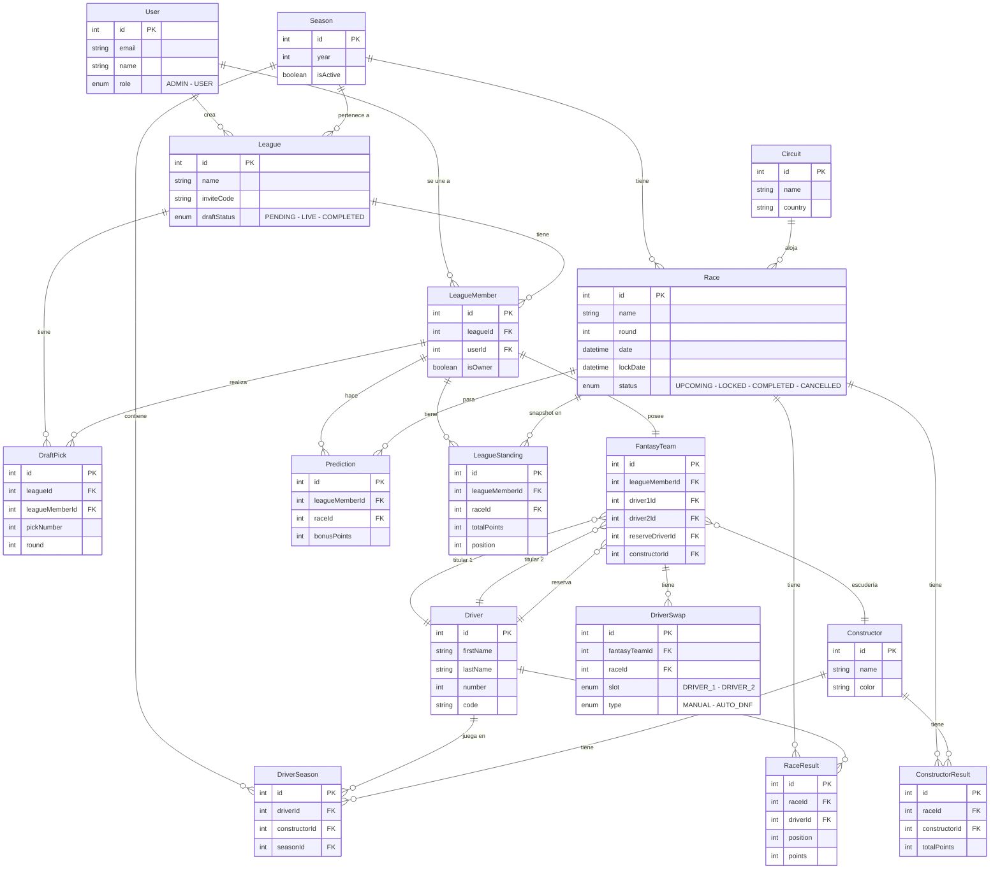

# Propuesta TP DSW

> **Documento académico — versión congelada para entrega.**
> El modelo y la API que aparecen acá pueden estar desactualizados respecto al estado actual del código y los docs vivos. Para referencia viva del dominio ver [`data-model.mmd`](./data-model.mmd) + [`domain-entities.md`](./domain-entities.md); para la API ver [`api-endpoints.md`](./api-endpoints.md); para qué está construido y qué falta ver [`roadmap.md`](./roadmap.md).

## Grupo

### Integrantes

- 52265 - Pinolini, Tomás
- 51070 - Rivero, Tomás

### Repositorios

- [fullstack app](https://github.com/TomasPinolini/boxbox)

### Pull Requests

El trabajo se integró por PR. Hubo una única excepción: el commit [`1f5278b`](https://github.com/TomasPinolini/boxbox/commit/1f5278b), directo a `main`, que corrigió los legajos en este mismo documento.
Listado completo: **[PRs mergeados](https://github.com/TomasPinolini/boxbox/pulls?q=is%3Apr+is%3Amerged)** (37 a la fecha).

Desglose por entregable, para la defensa:

| Entregable | Pull Requests |
| :--------- | :------------ |
| Auth (login + 2 niveles de acceso) | [#3](https://github.com/TomasPinolini/boxbox/pull/3), [#15](https://github.com/TomasPinolini/boxbox/pull/15) |
| CRUDs de catálogo y ligas | [#5](https://github.com/TomasPinolini/boxbox/pull/5), [#7](https://github.com/TomasPinolini/boxbox/pull/7) |
| **Epic 1 — Draft en vivo** (Rivero) | [#9](https://github.com/TomasPinolini/boxbox/pull/9), [#12](https://github.com/TomasPinolini/boxbox/pull/12), [#14](https://github.com/TomasPinolini/boxbox/pull/14), [#35](https://github.com/TomasPinolini/boxbox/pull/35), [#38](https://github.com/TomasPinolini/boxbox/pull/38) |
| **Epic 2 — Resultados y standings** (Pinolini) | [#4](https://github.com/TomasPinolini/boxbox/pull/4), [#17](https://github.com/TomasPinolini/boxbox/pull/17), [#32](https://github.com/TomasPinolini/boxbox/pull/32), [#34](https://github.com/TomasPinolini/boxbox/pull/34), [#37](https://github.com/TomasPinolini/boxbox/pull/37), [#39](https://github.com/TomasPinolini/boxbox/pull/39) |
| Frontend — bootstrap y pantallas base | [#18](https://github.com/TomasPinolini/boxbox/pull/18), [#20](https://github.com/TomasPinolini/boxbox/pull/20), [#22](https://github.com/TomasPinolini/boxbox/pull/22), [#25](https://github.com/TomasPinolini/boxbox/pull/25) |
| Listado con filtro + detalle | [#30](https://github.com/TomasPinolini/boxbox/pull/30) |
| Protección de rutas por rol | [#33](https://github.com/TomasPinolini/boxbox/pull/33) |
| Hardening y correcciones de review | [#13](https://github.com/TomasPinolini/boxbox/pull/13), [#16](https://github.com/TomasPinolini/boxbox/pull/16), [#24](https://github.com/TomasPinolini/boxbox/pull/24), [#27](https://github.com/TomasPinolini/boxbox/pull/27), [#36](https://github.com/TomasPinolini/boxbox/pull/36) |

## Stack tecnológico

> **Declaración de uso de tecnologías alternativas**, según lo que pide el
> [`FAQ.md`](https://github.com/utnfrrodsw/tp/blob/main/FAQ.md) de la cátedra:
> *"Es bienvenido que los alumnos opten por el uso de otras tecnologías equivalentes por
> motivos de aprendizaje, curiosidad o motivación propia, deberán informarlo claramente en
> la proposal y ser aprobado por el profesor."*
>
> **Se solicita la aprobación del profesor para este stack.**

| Capa | Lo enseñado en la cátedra | Lo que usa BoxBox |
| :--- | :------------------------ | :---------------- |
| Backend | Express + TypeScript | **Express 5 + TypeScript** (igual) |
| ORM | MikroORM | **Prisma 7** |
| Base de datos | MySQL | **PostgreSQL** (hosteado en Supabase) |
| Frontend | Angular | **React 19 + Vite + Tailwind CSS v4** |
| Realtime | — | **Socket.io** (para el draft en vivo) |
| Tests | — | **Vitest + Supertest** (backend), **Vitest + Testing Library + Playwright** (frontend) |

**Motivo.** Aprendizaje. Los dos integrantes querían trabajar con el ecosistema que domina
el mercado en 2026 y que ninguno había usado antes en un proyecto de esta escala. La
elección de Prisma sobre MikroORM está documentada con sus alternativas y consecuencias en
[`ADR-0001`](./adr/ADR-0001-prisma-over-mikroorm.md); la de Postgres en Supabase sobre
self-hosting, en [`ADR-0007`](./adr/ADR-0007-supabase-postgres-hosting.md).

**Responsabilidad asumida.** La FAQ aclara que *"la cátedra no puede asegurar que sea capaz
de proveer soporte para estas tecnologías"*. Se asume esa responsabilidad: la obligación de
cumplir todos los requisitos técnicos queda del lado del grupo.

**Cumplimiento de los requisitos técnicos con este stack.** Se verificó punto por punto
contra la FAQ:

| Requisito | Cómo lo cumple |
| :-------- | :------------- |
| Framework web con soporte de middleware | Express 5, con cadena de middlewares (`helmet → cors → json → cookieParser → routers → errorHandler`) |
| API REST para comunicarse con el frontend | REST sobre `/api/v1`, con envelope `{ data }` / `{ error }` |
| Base de datos **como servicio independiente**, no embebida | PostgreSQL en Supabase. No es SQLite ni ninguna embebida |
| Persistencia en disco, concurrente, no local | Servicio hosteado, accesible por red, con conexiones concurrentes |
| Acceso mediante **ORM** (o patrón repository si no existe ORM) | Prisma 7, con driver adapter `@prisma/adapter-pg`. Al existir ORM, no se implementa Repository — decisión documentada en [`ADR-0002`](./adr/ADR-0002-no-repository-pattern.md) |
| Arquitectura en capas | `routes → controller → service → Prisma`, una carpeta por módulo de dominio |
| Validación de entrada y manejo de errores por API | Zod en cada endpoint; errores centralizados en un `errorHandler` con códigos de dominio |
| Dependencias declaradas | `backend/package.json` y `frontend/package.json` |
| CSS mediante framework o preprocesador, mobile-first | Tailwind CSS v4, que es mobile-first por defecto (los prefijos `sm:`/`md:`/`lg:` suben, no bajan) |
| Definición de ambientes | `.env` validado con Zod al bootear (`src/config/env.ts`); el server no arranca si falta algo |

---

## Tema

### Descripción

BoxBox es una aplicación de Fantasy League de Fórmula 1. Los usuarios crean o se unen a ligas privadas mediante código de invitación, participan en un draft en vivo con formato snake para armar su equipo (2 pilotos titulares, 1 reserva y 1 escudería), y compiten a lo largo de la temporada. Los resultados reales de cada carrera se obtienen de APIs públicas de F1 para calcular los puntajes. Además, los usuarios pueden realizar predicciones antes de cada carrera y visualizar resúmenes de rendimiento.

### Modelo

```mermaid
erDiagram
    User ||--o{ LeagueMember : "se une a"
    User ||--o{ League : "crea"

    Season ||--o{ Race : "tiene"
    Season ||--o{ League : "pertenece a"
    Season ||--o{ DriverSeason : "contiene"
    Circuit ||--o{ Race : "aloja"

    Driver ||--o{ DriverSeason : "juega en"
    Constructor ||--o{ DriverSeason : "tiene"

    League ||--o{ LeagueMember : "tiene"
    League ||--o{ DraftPick : "tiene"

    LeagueMember ||--|| FantasyTeam : "posee"
    LeagueMember ||--o{ DraftPick : "realiza"
    LeagueMember ||--o{ Prediction : "hace"
    LeagueMember ||--o{ LeagueStanding : "tiene"

    FantasyTeam ||--o{ DriverSwap : "tiene"
    FantasyTeam }o--|| Driver : "titular 1"
    FantasyTeam }o--|| Driver : "titular 2"
    FantasyTeam }o--|| Driver : "reserva"
    FantasyTeam }o--|| Constructor : "escudería"

    Race ||--o{ RaceResult : "tiene"
    Race ||--o{ ConstructorResult : "tiene"
    Race ||--o{ Prediction : "para"
    Race ||--o{ LeagueStanding : "snapshot en"

    Driver ||--o{ RaceResult : "tiene"
    Constructor ||--o{ ConstructorResult : "tiene"

    User {
        int id PK
        string email
        string name
        enum role "ADMIN - USER"
    }
    Driver {
        int id PK
        string firstName
        string lastName
        int number
        string code
    }
    Constructor {
        int id PK
        string name
        string color
    }
    Circuit {
        int id PK
        string name
        string country
    }
    Season {
        int id PK
        int year
        boolean isActive
    }
    DriverSeason {
        int id PK
        int driverId FK
        int constructorId FK
        int seasonId FK
    }
    Race {
        int id PK
        string name
        int round
        datetime date
        datetime lockDate
        enum status "UPCOMING - LOCKED - COMPLETED - CANCELLED"
    }
    League {
        int id PK
        string name
        string inviteCode
        enum draftStatus "PENDING - LIVE - COMPLETED"
    }
    LeagueMember {
        int id PK
        int leagueId FK
        int userId FK
        boolean isOwner
    }
    FantasyTeam {
        int id PK
        int leagueMemberId FK
        int driver1Id FK
        int driver2Id FK
        int reserveDriverId FK
        int constructorId FK
    }
    DraftPick {
        int id PK
        int leagueId FK
        int leagueMemberId FK
        int pickNumber
        int round
    }
    DriverSwap {
        int id PK
        int fantasyTeamId FK
        int raceId FK
        enum slot "DRIVER_1 - DRIVER_2"
        enum type "MANUAL - AUTO_DNF"
    }
    RaceResult {
        int id PK
        int raceId FK
        int driverId FK
        int position
        int points
    }
    ConstructorResult {
        int id PK
        int raceId FK
        int constructorId FK
        int totalPoints
    }
    Prediction {
        int id PK
        int leagueMemberId FK
        int raceId FK
        int bonusPoints
    }
    LeagueStanding {
        int id PK
        int leagueMemberId FK
        int raceId FK
        int totalPoints
        int position
    }
```

## Alcance Funcional

### Alcance Mínimo

Regularidad:

| Req                     | Detalle                                                                                                                                                         |
| :---------------------- | :-------------------------------------------------------------------------------------------------------------------------------------------------------------- |
| CRUD simple             | 1. CRUD Driver 2. CRUD Constructor                                                                                                                           |
| CRUD dependiente        | 1. CRUD Race {depende de} CRUD Circuit + CRUD Season                                                                                                            |
| Listado + detalle | 1. Listado de pilotos filtrado por escudería, muestra nombre, número y equipo => detalle muestra estadísticas del piloto y resultados de carrera                |
| CUU/Epic                | 1. Realizar el draft en vivo de un equipo fantasy (snake draft con timer, selección de 2 pilotos titulares, 1 reserva y 1 escudería, picks exclusivos por liga) |

Adicionales para Aprobación:

| Req      | Detalle                                                                                                                                                                                                                                                                                                                                                                                                                      |
| :------- | :--------------------------------------------------------------------------------------------------------------------------------------------------------------------------------------------------------------------------------------------------------------------------------------------------------------------------------------------------------------------------------------------------------------------------- |
| CRUD     | 1. CRUD Driver 2. CRUD Constructor 3. CRUD Circuit 4. CRUD Season 5. CRUD Race 6. CRUD League 7. CRUD FantasyTeam                                                                                                                                                                                                                                                                                          |
| CUU/Epic | 1. Realizar el draft en vivo de un equipo fantasy (snake draft con WebSocket, timer por pick, auto-pick en timeout, selección libre de categoría por ronda, picks exclusivos dentro de la liga) 2. Procesar resultados de carrera y actualizar standings (fetch desde APIs externas de F1, cálculo de puntajes de pilotos y escuderías, evaluación de predicciones, actualización del leaderboard y generación de recaps) |

### Alcance Adicional Voluntario

| Req      | Detalle                                                                                                                                                                                                                                                                                                                         |
| :------- | :------------------------------------------------------------------------------------------------------------------------------------------------------------------------------------------------------------------------------------------------------------------------------------------------------------------------------ |
| CUU/Epic | 1. Sistema de predicciones pre-carrera (predicción de ganador, pole position y equipo con más puntos, con puntaje bonus por acierto, lock antes de la clasificación) 2. Resúmenes de carrera (desglose de puntos por piloto, resultado de predicciones, cambio de posición en standings, comparación vs promedio de la liga) |
| Listados | 1. Standings históricos filtrado por carrera, muestra posición, puntos totales y cambio de posición 2. Historial de swaps de pilotos filtrado por carrera                                                                                                                                                                    |
| Otros    | 1. Integración con APIs externas de F1 (Jolpica, OpenF1) para sincronización de datos reales 2. Draft en tiempo real via WebSocket con reconexión y pausa                                                                                                                                                                    |

---

## Desvíos respecto de esta propuesta

Esta propuesta quedó congelada en su versión de entrega. Durante la construcción hubo
un desvío de alcance que se decidió y documentó formalmente, y que se comunicó a la
cátedra por mail el **2026-09-11**.

### Draft de 3 rondas, sin piloto reserva

**Lo propuesto.** El draft seleccionaba "2 pilotos titulares, 1 reserva y 1 escudería"
(4 rondas), y el alcance voluntario incluía un historial de swaps de pilotos.

**Lo implementado.** El draft tiene **3 rondas**: 2 pilotos y 1 escudería. No hay piloto
reserva y no hay swaps.

**Por qué.** La decisión y sus alternativas están en
[`ADR-0006`](./adr/ADR-0006-draft-3-rondas-sin-reserva.md). La reserva sólo tenía sentido
acompañada de un mecanismo de swap, y ese mecanismo agregaba una máquina de estados
completa (cuándo se puede swapear, contra qué carrera, con qué lock) sin aportar nada a
ninguno de los requisitos de la rúbrica.

**Consecuencias en el código**, para que la defensa cierre con lo que se ve:

- El tope de miembros por liga pasó a ser `floor(driverCount / 2)` — 11 para 2026 — porque
  cada integrante se lleva 2 pilotos. Excederlo devuelve `409 MAX_MEMBERS_EXCEEDS_SEASON`.
- El ítem "Historial de swaps de pilotos" del Alcance Adicional Voluntario queda sin efecto.

### Estado del Alcance Adicional Voluntario

El alcance voluntario se entregó de forma parcial, que es la naturaleza de ser voluntario:

| Ítem | Estado |
| :--- | :----- |
| Integración con APIs externas de F1 (Jolpica) | **Entregado** — sync de calendario y resultados |
| Standings históricos por carrera | **Entregado** — `LeagueStanding` por fecha, con cambio de posición |
| Sistema de predicciones pre-carrera | No construido |
| Resúmenes de carrera | No construido |
| Historial de swaps de pilotos | Sin efecto — ver ADR-0006 |
| Draft con reconexión y pausa | No construido — fuera de alcance, ver [`roadmap.md`](./roadmap.md) |
